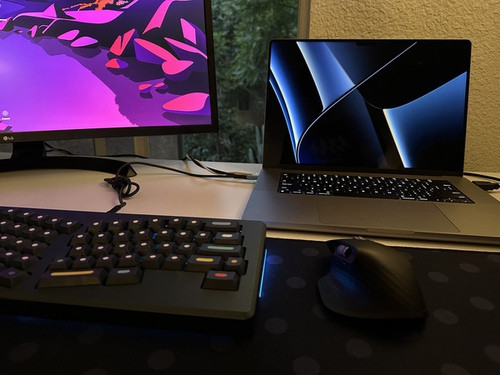

# Daniel Ziper's Home

Hello viewers of this page, I'm Daniel, a 3rd year Computer Engineering student at UCSD!
This page talks about who I am [as a person](#who-am-i-as-a-person) and [as a programmer](#whoami-as-a-programmer).


## `whoami` as a Programmer?

```
(base) dziper@MacBook-Pro ~ % whoami
dziper
```

### My SWE Experience
1. Joined Basement startup **Mercury Health** in Winter '22
   - `python` development for core device code
   - Integrating `aws` Services such as DynamoDB, Lambda, Sagemaker
2. Interned at **Roku** for Summer '21, '22
   - `c++` Embedded Development for RokuOS Firmware
   - `swift` Development for iOS

### My Setup



- M1 Macbook Pro, 16"
- A [mechanical keyboard](keyboards.md)
- MX Master 3 Mouse
- LG Monitor

### My Favorite Tools
- IDE: PyCharm
- Terminal: Warp
- OS: macOS
- Note taking: Obsidian
- Theme: Dracula

### Classes I'm taking F22
1. CSE 110
2. CSE 101
3. CSE 140/140L
4. CSE 167

## Who am I as a *Person*?

> If it works, it is a good plan. If it doesn't, then it is a bad plan.
> - Bjorn

### My favorite...
- Sport: Skiing
- Video Game: Dead Cells
- Band: Milky Chance

### Hobbies
- Guitar
- Chess
- Running
- Skiing

# TODO
- [x] Pictures
- [x] Core Markdown Syntax in [Github Flavored Markdown](https://docs.github.com/en/free-pro-team@latest/github/writing-on-github/basic-writing-and-formatting-syntax)
  - [x] Headings
  - [x] Styling test
  - [x] Quoting text
  - [x] Quoting code
  - [x] External Links
  - [x] Section Links
  - [x] Relative Links
  - [x] Ordered Lists
  - [x] Unordered Lists
  - [x] Task Lists
